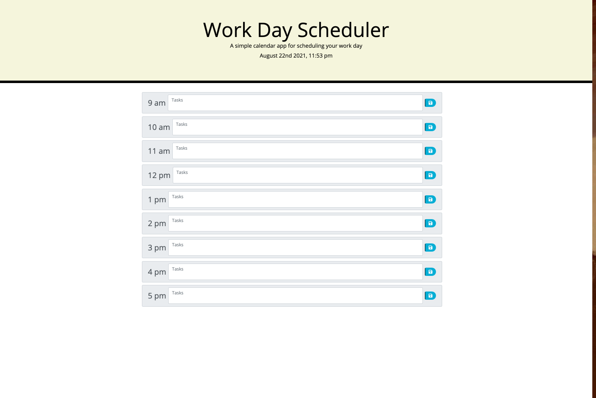

Calandar PLanner

This Calendar Application was created using JQuery, Javascript, HTML, and CSS.This Applications main focus is to deliever to the user a simple way to logs important details they want inside if their planner.

This Planners main functions and abbilites are

* Be able to tell the time of date throught the following (Month/day/Year/Time) time structure located in the header of the page.

* Able to allow the user to store whatever it is they want to store in the box where is says "tasks".

* Able to tell what events have past, are present, and are in the future through the following color cordination where gray=present, green=future,red=past, and this would be located through the different hours in the day.

* Able to store whatever the user wants in their description without it getting deleted when you refresh the page.

Below is the following screenshot of the page

;

Below is a link to the Finished Calendar website

https://stephenryan183.github.io/calendar-planner/

